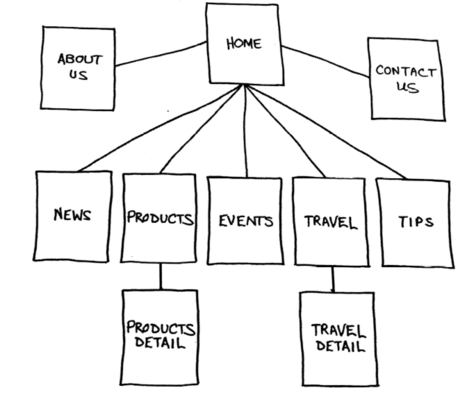
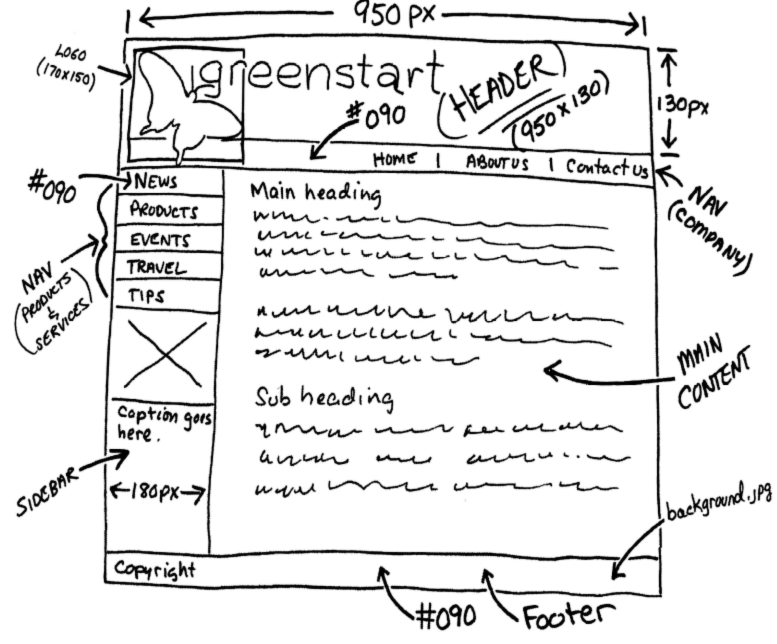
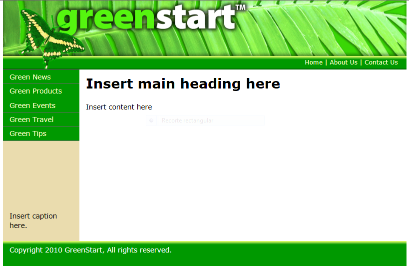
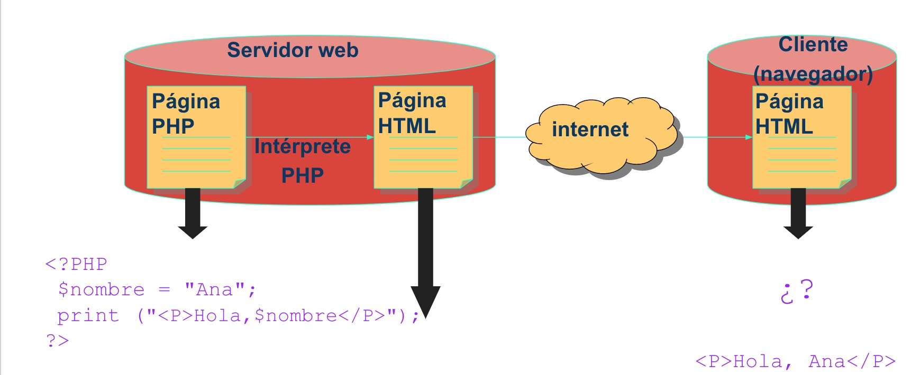

# TEMA 1

## Introducción a la WWW

#### EI1042 - Tecnologías y Aplicaciones Web

#### EI1036- Tecnologías Web para los Sistemas de Información (2019/2020)

##### Profesora: Dra. Dolores María Llidó Escrivá


[Universitat Jaume I](https://www.uji.es/).

---

## Tabla de contenidos

- Arquitectura cliente servidor Web
- Localitzación de recursos: URL
- Clientes Web
- Servidores Web
- El protocolo HTTP
- Proceso de producción del portal web
- Definición un proyecto Web
- Servidor web con PHP.
- Configuración Apache:.htaccess

---

## Arquitectura Cliente Servidor


<!-- img src="./media/T1/image2.png" -->

---

### HTML


```<!DOCTYPE html >```

``` <li id="section-3" class="section main clearfix" role="region" aria-label="Laboratorio">```

---

## URL: Uniform Resource Locator

Són cadenas de caracteres con un formato que identifica recursos indicando su dirección electrónica


```<esquema>://<user>:<password>@<host>:<port>/<url-path>```

esquema=protocolo sistema:
  
- http://host[:port][abs_path]

- http://anubis.uji.es/index.html

- ftp://al007@anubis.uji.es/un/ejemplo.txt
  

  https://aulavirtual.uji.es/course/view.php?id=64297#section-3

---

### Exemples URL HTTP

- [http://www.milanuncios.com/informaticos-en-almeria/pp.htm?dias=1&demanda=n](http://www.milanuncios.com/informaticos-en-almeria/pp.htm?dias=1&demanda=n)
- https://duckduckgo.com/?q=pp&t=ffab&ia=about
- https://www.google.es/search?q=llido&as_sitesearch=uji.es&gfe_rd=ssl&ei=pRDx
- [http://dllido.al.nisu.org/EI1036_1042/PortalJson.php?action=modificarAlumnoJson](http://dllido.al.nisu.org/EI1036_1042/PortalJson.php?action=modificarAlumnoJson)
- https://aulavirtual.uji.es/course/view.php?id=64297#section-3

Caràcteres especiales:

- /: Indica path del recurso
- #: indica una etiqueta que tiene el id referenciado (< id==section-3>)
- &,=: El cliente web los datos del formulario cuando se usa el método get los envia como pares nombre=valor unidos por &

---

### URL amigables

[http://www.example.com/camaras/reflex/canon-eos-5d-mark-2/](http://www.example.com/camaras/reflex/canon-eos-5d-mark-2/)

- Mejora el SEO
- El servidor  manipula la URL para redireccionarlos a los recursos internos correctamente.

---

## Clientes Web CURL/GET

<small>curl http://www.pekegifs.com/pekemundo/dibujos/colorearonline.htm  -o pp.html
</small>

- Descargar un documento html.
   
<small> wget ‐‐level=1 ‐‐recursive ‐‐no-parent ‐‐accept mp3,MP3 http://example.com/mp3/
</small>

- Descargar todos los ficheros MP3 de un subdirectorio.

<small>

---

## Servidor Web 

- Servidor Web Apache
- ```php -S localhost```

---

## El protocolo HTTP

Cliente

```txt
 GET /un/ejemplo.html HTTP/1.0 CRLF
 User Agent: Mozilla CRLF
 (..)
 Referer:http://anubis.uji.es/index.html
 CRLF
```

Servidor

```txt
 HTTP/1.1 200 OK CRLF
 Date: Mon, 27 Sep 199 21:23:20 GMT CRLF
 Server: Apache/1.3.3 (Unix) CRLF
 Last-Modified: Sun, 26 Sep 1999 ... CRLF
 Content-Length: 5654 CRLF
 Content-Type: text/html CRLF
 CRLF
 <PAGE HTML>
```

---

### Métodos

 GET|HEAD|POST|PUT|DELETE |OPTIONS|TRACE

- HEAD: recupera las cabeceras HTTP de respuesta.
  - obtener meta-información sobre el recurso.
  - comprobar la validez de hiperenlaces.
  - comprobar la accesibilidad, actualización, etc.
- POST: ejecuta el recurso con los datos del cuerpo de la petición.
  - Envío de un mensaje a un grupo de noticias.
  - Insertar un nuevo registro en una base de datos.
  - Formularios.

---

### Códigos de estado HTTP

- 2xx: la petición se realizó con éxito.
- 200 OK.
- 3xx: redirecciones.
- 301 Moved Permanently.
- 302 Moved Temporarily
- 4xx: error del cliente
- 400 Bad Request
- 403 Forbidden
- 404 Not Found
- 5xx: error del servidor
- 500 Internal Server Error
- 501 Not Implemented

---

### Robots.txt

- Fichero donde indicar el comportamiento que tienen que tener los buscadores y los programas de descargas sobre el servidor.

- Se supone que todos los
programas de descarga deben
respetarlo, aunque no siempre es
así.

- Se utilizan 2 directivas:
  - User-agent:
  - Disallow:

---

### Ejemplos:

```txt
#Para desactivar todas la arañas:
User-agent: *
Disallow: /

#Prohibimos que las arañas carguen los directorios /cgi-bin/ y /imágenes/
User-agent: *
Disallow: /cgi-bin/
Disallow: /imagenes/

#Prohibimos que emailspider lea cualquier página
User-agent: emailspider
Disallow: /
```

---

### Sesión

HTTP es un protocolo sin sesión.

- ¿Cómo evitamos que pida reiteradamente la autentificación?
- ¿Cómo recordamos el carrito de la compra?

---

#### Simulación de la Sesión

- A partir de controles HTML ocultos.
<small>```<INPUT type="hidden" name="session" value="1234">```</small>
- URL rewriting.
- Uso cookies.
- Una combinación de cookie y bases de datos.
- Usar el objeto **SESSION**  provisto por los entornos de programación como PHP, ASP o J2EE

---

### URL REWRITING

Consiste en incluir la información del estado en la propio URL

http://www.pekegifs.com/pekemundo/dibujos//comprar.asp?paso=3&producto1=01992CX&producto2=ZZ112230&

---

### Cookies

Una cookie es información que un servidor puede enviar al cliente para que la almacene y se reenvíe en posteriores accesos (header).

Permiten:

- Recordar preferencias de un cliente para generar contenido personalizado
- Para almacenar información de sesión
- En general: para “simular” sesiones
- No para almacenar información privada. claves, cuentas...


---

#### Variables de las  Cookies

fichero con pares nombre=valor de tamaño limitado.

- name= nombre de la cookie
- expires=DD-Month-YY HH:MM:SS GMT fecha caducidad.
- secure=tipo de seguridad (sólo en HTTPS)
- path= ruta específica a los recursos a los que se envía la - cookie. Por defecto lo añade el servidor.
- domain=ámbito con el cual el cliente identifica si debe enviar la cookie al servidor

---

#### Ejemplo de cookies  en Chrome


---

#### Contras Cookies

- Privacidad: Otros servidores podrían pueden leer información de las cookies del cliente.
- Los datos pueden ser alterados: Un usuario podría modificar el fichero de una cookie.
- Implementación compleja: Mantener “a mano” el estado en el cliente es complicado si queremos hacerlo de manera robusta.
- Tamaño de datos limitado: Tanto el tamaño máximo permitido por las cookies como la longitud máxima de una URL pueden darnos problemas.

---

## Proceso de Producción de un Proyecto Web

- Planificación
- 
- Diseño
- Desarrollo
- Implementación
- Evaluación
- Mantenimiento

---

## Definición un proyecto Web 
### Arquitectura de la informació: Thumbnail
 

---

### Diseño web:  WireFrame


---

### Prototipado: Mockup

 


---

### Definición de la interficie de cada servicio

| Title                | Título                                   |
| -------------------- | ----------------------------------------- |
| URL             | URL                                         |
| Method          | GET/POST                                    |
| URL Params | Parámetros en la URL                        |
| Data Params   | Parámetros que requiere/envía el formulario |
| Success  | Respuesta si el registro es correctamente   |
| Error    | Respuesta si hay algún error                |
| Notes           | Precondiciones/postcondiciones              |

---

| Title                | R01 Name:​Registro                                   |
| -------------------- | ----------------------------------------- |
| URL             | Portal.php​?action=registro      |
| Method          | GET                                    |
| URL Params | action                        |
| Description     | ​El usuario quiere registrarse en el portal. |
| Data Params   | Nombre, Email, Clave |
| Success  | Portal.php​?action= registrar    |
| Error  | Indica errores y vuelve cargar la misma página |
| Notes           |  - Poner un enlace en portal en el menú pero ocultar al autentificar. |
| | - Al  hacer click  se muestra formulario. |
| | - Tras rellenar campos el usuario debe dar a enviar. |

---

## Servidor WEB con PHP

¿Cómo funciona el intérprete de PHP?

 

---

## Configuración Servidor apache:.htaccess
- http.conf

- .htaccess (personalizado en directorios)

Más Info:
- [http://httpd.apache.org/docs/2.2/es/](http://httpd.apache.org/docs/2.2/es/)

- [http://php.net/manual/es/](http://php.net/manual/es/)

```txt
#.htaccess
Options +Indexes
RewriteEngine on
RewriteBase /Lab2017/T
RewriteRule pp/(.*)/(.*)$   phpInfo.php?Val1=$1&Val2=$

```

---

### Ejemplos .htaccess

```txt
#  listar directorios
Options +Indexes
IndexOptions -FancyIndexing
```

https://piruletas.000webhostapp.com/teoria/T2/

```txt
# No listar directorios
Options -Indexes
```

https://piruletas.000webhostapp.com/teoria/

---

## ¿Dudas?

 

