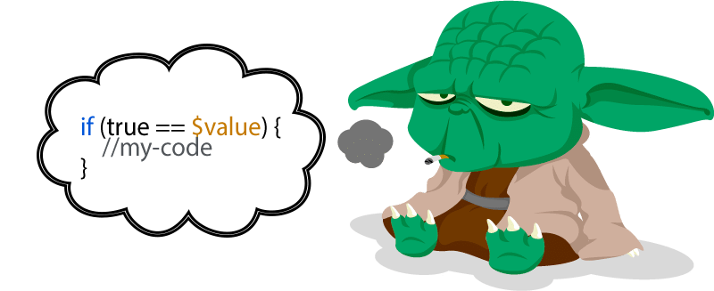
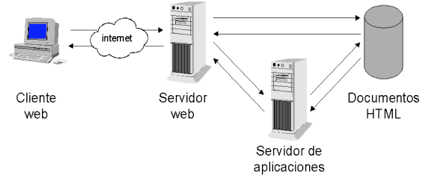
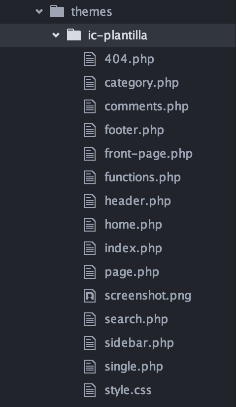
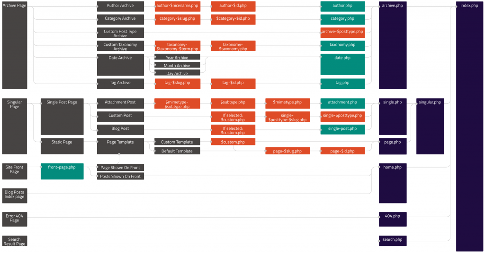
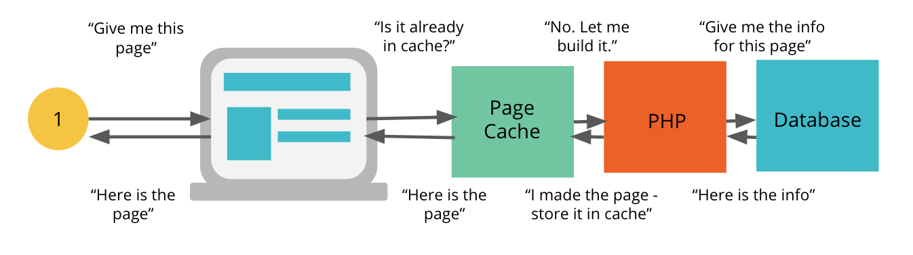
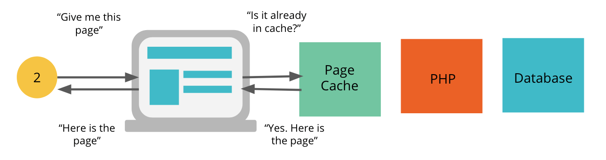
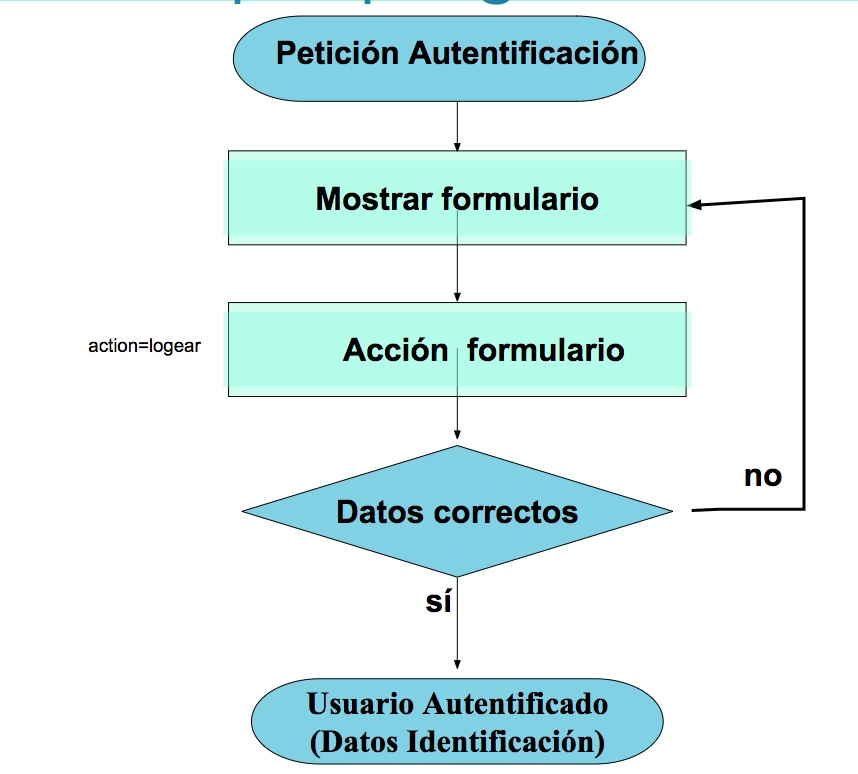

# Tema 2: Introducción al PHP

### EI1042 - Tecnologías y Aplicaciones Web

**EI1036- Tecnologías Web para los Sistemas de Información (2020/2021)**

##### Profesorado: Dra. Dolores María Llidó Escrivá


[Universitat Jaume I](https://www.uji.es/).

---

### Índice

- Introducción a PHP
- Paginas dinámicas con php
- PHP avanzado
- Wordpres y PHP

---

# 1. Introducción al PHP

- Creado por Rasmus Lerdorf para uso personal en 1994 
- PHP es un lenguaje de script del lado del servidor.
- PHP: Hypertext Preprocessor
- Versión actual: PHP 7
- Es potente, fácil de aprender, de libre
  distribución, permite el acceso a bases de datos y otras
  funcionalidades orientadas a la red
- Dispone de abundante soporte en la Web

Manual PHP: http://php.net/manual/es/

---

## 1.2. Sintaxis básica PHP

- PHP es sensible a mayúsculas/minúsculas **solo para las variables**.
- Las instrucciones se separan con ";"
- Espacios en blanco y cambios de línea no se tienen en cuenta.
- PHP interpreta entre comillas dobles pero no entre comillas
  simples.
- Se utiliza codificación UTF-8.
- Comprobar que el editor no ha generado un BOM ( _byte order mark_ de unicode en la primera línea)

Guia Estilos: https://www.php-fig.org/psr/psr-2/

--

### Usar: YodaStyle



Comparaciones al revés para evitar equivocarnos.

---

### Ejecución PHP

- Consola

```php
php.exe "./bienvenidos.php"
```

- Entorno php:

```php
>>php -a
$hola="Adios";
$echo $hola
```

- Servidor web:
  https://asociacionpiruleta.cloudaccess.host/PHP/T2/holaMundo.php

- Servidor web local:

```php
php [options] -S <addr>:<port> [-t docroot]
php -S localhost:8080
```

--

### Ejemplo fichero PHP

```PHP
<?php
$var = "test";
echo "$var"; // Salida:"test“
echo "\$var"; // Salida:" "$var"
echo '$var'; // Salida:" "test"
# otro comentario hasta el final de la línea
// este también es de línea
/* comento
varias líneas */
?>
```

---

## 1.3. Tipos de datos

- Tipos escalares: boolean, integer, double, string
- Tipos compuestos: array, object
- Tipos especiales: resource, NULL
- Las variables no declaradas se asocian a NULL y se imprimen como cadenas vacías.
- El tipo resource no lo veremos este curso por ser un tópico avanzado

--

### Array Asociativo

Sintaxis:
array ([clave =>] valor, ...)

```PHP
$medidas = array (10, 25, 15);
echo $medidas[0];

$color = array ('rojo'=>101, 'verde'=>51, 'azul'=>255);

#Acceso:
echo $color['rojo']; // No olvidar las comillas
echo array_keys($color);
```

---

## 1.4. Salida estándar

¿Cómo enviar mensajes a la salida estándar?

- echo — Muestra una o más cadenas separada por ','.
- print — Mostrar solo una cadena.
- printf — Imprimir una cadena con formato.
- print_r — Imprime información legible para humanos.
- var_dump— Vuelca información sobre una variable. La información y su tipo

--

### Diferencias echo o print

- **Void** echo (string argument1[,...string argumentN])
- **Int** print (argument)
  - print solo tiene un argumento (echo puede tener varios)
  - si print devuelve 1 (significa que ha generado la salida)

No es obligatorio el uso de paréntesis ya que no son
realmente una función.

```PHP
echo "Hola mundo";
echo "Hola ", "mundo"; //dos argumentos
print "Hola mundo";
print "Hola ". "mundo"; // el operador '.' concatena cadenas
```

---

## 1.5. Variables

- No se declara el tipo de las variables.
- Las variables se pueden asignar
  - Por valor
  - Por referencia (con &)
  - Creación de nombres de variables dinámico.

```PHP
$x='equis';
$_x = &$x; //referencia a $x
$_x ='x';
echo $x; //salida: x
echo $_x; //salida: x
$a = "hola";
$$a = "mundo"; //nombrar una variable con otra variable
print "$a $hola\n"; //salida: hola mundo
print "$a ${a}s\n"; //salida: hola hola 
//utilizaremos ${} para evitar errores
print "$a ${$a}";  //salida: hola mundo 
//podemos acceder al valor de una variable ($mundo) nombrada en otra ($a)
```

--

### ¿De qué tipo es la variable?

- gettype() devuelve el tipo de una variable
- is_type() comprueba si una variable es de un tipo dado:

```php
is_array(), is_bool(), is_null(), is_object(), is_resource(),
is_scalar(),is_string(),is_float(), is_integer(), is_numeric(),is_nan()
```

--

### Ámbito de variables

- Local: Variable definida en una función
  - Está limitada a dicha función.
  - Se elimina al acabar la ejecución de la función
  - Salvo si la variable se declara como **static** .
- Global:
  - No se puede definir dentro de las funciones a menos que :
    - se declare en la función con la palabra clave 'global'
    - O que se acceda con el array $GLOBALS[indice]
  - Existen durante todo el tiempo de proceso del fichero
  - Al acabar de procesar el fichero se eliminan las variables globales

---

## 1.6. Funciones

```PHP
function suma ($x, $y)
{
   $s = $x + $y;
   return $s;
}
```

Salida:

```
$a=1;
$b=2;
$c=suma ($a, $b);
print $c;
```

--

### Paso parámetros

- Por defecto paso parámetros por valor
- Paso por referencia:

```PHP
function incrementa (&$a)
{
  $a = $a + 1;
}
$a=1;
incrementa ($a);
print $a; // Muestra un 2
```

--

### Argumentos por defecto

- Los argumentos con valores por defecto deben ser siempre
  los últimos:

```PHP
function muestranombre ($nombre, $titulo= "Sr.")
{
  print "Estimado $titulo $nombre:\n";
}
muestranombre (“Fernández”);
muestranombre (“Fernández”, "Prof.");
```

Salida:

```
Estimado Sr. Fernández:
Estimado Prof. Fernández:
```

---

# 1.7. OOP en PHP

- PHP no es un lenguaje 100% Orientado a Objetos.
- Soporta:
  - Encapsulamiento.
  - Tipos Abstractos de Datos y ocultamiento de la Información.
  - Herencia.
  - Polimorfismo.

--

## Clases y Objetos
```php
class Myclass{
    const CONST_VALUE = 10;
    public $numero=5;
    function dameNumero(){
    return self::CONST_VALUE * $this->numero; }
    function llamoDame(){ return self::dameNumero();}
}
$classname = 'Myclass';
echo "<p>\r\n",$classname::CONST_VALUE,"</p>"; 
echo "<p>\r\n",Myclass::CONST_VALUE,"</p>";
$datos=new  Myclass();
$datos->numero=15;
echo "<p>\r\n",$datos->dameNumero(),"</p>";
echo "<p>\r\n",$datos->llamoDame(),"</p>"; 

```

- `::` operador de Resolución de Ámbito. Permite acceder a elementos estáticos/constantes y sobrescribir propiedades o métodos.
- `->` permite acceder a las propiedades y métodos de un objeto.

--

### $this, self, parent

- `$this` es una variable especial que auto-referencia al objeto para acceder a sus métodos y propiedades.
- `self` y `parent`: son pseudo-variables para acceder a una propiedad o método de una clase.
- Usamos `$this->` para hacer referencia al objeto (instancia) actual, y `self::` para referenciar a la clase actual.

```PHP
$this->nombre
self::nombre
```

---

# 2. Páginas web dinámicas con PHP

- El cliente no ve el código PHP sino los resultados que produce en la salida estándar.
- Apache ejecuta php no como un [CGI](https://httpd.apache.org/docs/trunk/es/howto/cgi.html) sino como un módulo.

Version php S.O. != Apache



Seguridad: Ficheros sensibles estar fuera de la raíz (docroot-httpdocs) del servidor web.

---

### Ejercicio 1

https://asociacionpiruleta.cloudaccess.host/PHP/P2/includes/portal.php?action=listar

Analiza la URL.

- ¿Cual es el nombre servidor?
- ¿Cual es el recurso?
- ¿Que parametros requiere el programa php?

---

Fichero con HTML con php:

bienvenido.php

```HTML
<body>
<p>Inicio</p>
<?php
$nombre = "Ana";
print(" <P>Hola, $nombre</P>");
 ?>
<p>Fin</p>
```

---

### Ejercicio 2

```php
>>php -S localhost:8080
```

- ¿Cuál es el docroot del servidor web?
- ¿Dónde ponemos el fichero tutoPhp.php en el servidor para acceder desde http://localhost/teoria/T2/tutoPHP.php?

--

### Servidor WEB en Producción

- Servidor web Apache (http://www.apache.org) con el módulo PHP (http://www.php.net)
- Base de datos MySQL (http://www.mysql.com) si se desea crear páginas dinámicas
- Herramientas para la gestión de MySQL, como PHPMyAdmin
  (http://www.phpmyadmin.net)

[Apache http://httpd.apache.org/docs/current/es/](http://httpd.apache.org/docs/current/es/)

--

## Servidor WEB en desarrollo: XAMPP

https://geekflare.com/es/lamp-lemp-mean-xampp-stack-intro/

- XAMPP es una distribución de Apache que incluye MySQL, PHP y phpMyAdmin
- XAMPP es gratuito y fácil de instalar
- XAMPP es multiplataforma
- Precaución: la configuración por defecto no es segura, ni para un entorno de producción.

--

## 2.1 Variables en el servidor web con php

### Superglobal

- Variables predefinidas en PHP
- Están disponibles en todos los ámbitos.

- $GLOBALS — Array con todas las variables disponibles en el ámbito global
  - $\_SERVER — Información del entorno del servidor y de ejecución
  - $\_GET(POST) — Variables HTTP GET(POST)
  - $\_FILES — Variables de Carga de Archivos HTTP
  - $\_REQUEST — Variables HTTP Request: GET+POTS+COOKIE
  - $\_SESSION — Variables de sesión
  - $\_COOKIE— Variables con datos de la cookie
  - $\_ENV— Variables del entorno

--

### Ejercicio 3

https://asociacionpiruleta.cloudaccess.host/PHP/T2/tutoPhp.php

- Analiza este fichero y mira el funcionamiento.

---

## 2.2. Formularios

### Ejemplo: radio

```HTML
<form action="procesar.php" method="post">
Sexo:
  <INPUT TYPE="radio" NAME="sexo" VALUE="M" CHECKED >Mujer
  <INPUT TYPE="radio" NAME="sexo" VALUE="H">Hombre
  <INPUT TYPE="submit">
</form>

```

```PHP
#Procesar.php
<?PHP
$sexo = $_REQUEST["sexo"];
print ($sexo);
?>
```

--

### Ejercicio 4:

- ¿Cuál es la petición al servidor al pulsar submit/enviar?
- Añade el nombre de la persona en el formulario y muéstralo en Procesar.php.
- ¿Diferencia entre post y get?
- ¿Como probar que funciona el código php?

Simulando PETICIONES POST con parámetros

```
curl --data "param1=value1&param2=value2" http://hostname/resource
```

--

### CHECKBOX

```HTML
<INPUT TYPE="checkbox" NAME="extras[]" VALUE="garaje" CHECKED>Garaje
<INPUT TYPE="checkbox" NAME="extras[]" VALUE="piscina">Piscina
<INPUT TYPE="checkbox" NAME="extras[]" VALUE="jardin">Jardín
```

```PHP
<?php
$extras = $_REQUEST["extras"];
foreach ($extras as $extra)
    print ("$extra<BR>\n");
?>
```

--

### BUTTON

```HTML
<INPUT TYPE="button" NAME="actualizar" VALUE="Actualizar datos">
```

```PHP
<?php
$actualizar = $_REQUEST["actualizar"];
if ($actualizar)
  print ("Se han actualizado los datos");
?>
```

--

### SELECT múltiple

```HTML
Idiomas:
<SELECT MULTIPLE SIZE="3" NAME="idiomas[]">
  <OPTION VALUE="ingles" SELECTED>Inglés
  <OPTION VALUE="francés">Francés
  <OPTION VALUE="alemán">Alemán
  <OPTION VALUE="holandés">Holandés
</SELECT>
```

```PHP
<?php
$idiomas = $_REQUEST["idiomas"];
foreach ($idiomas as $idioma)
   print ("$idioma<BR>\n");
?>
```

---

<!-- # 3. Callback/Calleable/Retrollamadas


Un callback es un tipo de funciones que son pasadas como parámetros y que serán ejecutadas desde otra función o clase.
Generalmente se ejecutan cuando se producen eventos.

Ej: Uso en WordPress:

```php
function example_callback( $example ) {
    // Maybe modify $example in some way.
    return $example;
}
add_filter( 'example_filter', 'example_callback' );

```


xxx


Como en JavaScript, generalmente se utilizan funciones anónimas como callbacks.

```php
$saludo = function($nombre)
{
    printf("Hola %s\r\n", $nombre);
};

$saludo('Carlos'); // Devuelve Hola Carlos
call_user_func($saludo, "PHP"); // Devuelve Hola PHP
```

xxx

#  Funciones anónimas

Una función anónima no es más que una función que no tiene nombre.

```php
$saludo = function() {
    return "Hola que tal";
};

echo $saludo(),"<p>"; // Devuelve: Hola que tal
};
```

```php
function decir ($algo) {
    echo $algo();
}

decir(function(){
    return "Esto es algo";
});
 // Devuelve "Esto es algo".
```
xx

# Una clausura o closure


Una clausura o closure es una función anónima que captura el ámbito actual, y proporciona acceso a ese ámbito cuando se invoca el closure.

```php

$colorCoche = 'rojo';

$mostrarColor = function() use ($colorCoche) {
    echo "El color del coche es $colorCoche";
};

$mostrarColor(); // Mostrará El color del coche es rojo
```


Las clausuras permiten usar variables mediante la palabra use. Estas variables su ámbito es el de la función donde se definen, no son como las variables globales.


Si se altera el valor de la variable $colorCoche dentro de la clausura, no afectará a la variable original.

xx

```php
$colorCoche = 'rojo';

$mostrarColor = function() use ($colorCoche) {
    $colorCoche = 'azul';
};

$mostrarColor();
echo $colorCoche; // Mostrará rojo
```

xx

# 8. WP en PHP

¿Cómo se añaden funciones propias en WP?
- Creando en las plantillas las funciones: ```Code Snippets```.
- Creando un ```pluggin```.
- Añadir código personalizado a WordPress (en ```functions.php```). Para que no se borren al actualizar los plugins directamente en la carpeta /mu-plugins/. ("Must Use" plugins).

xx


## Sintaxis alternativa de estructuras de control¶

Código HTML oculto:

```php
<?php if ( is_user_logged_in() ) {
     echo "CUIDADO estas Logueado ok?";
} else {
     echo "CUIDADO NO Estas logeado.";
}?>
```

 PHP ofrece sintaxis alternativa para : if, while, for, foreach, y switch.

 En cada caso, la forma básica de la sintaxis alternativa es cambiar la llave de apertura por dos puntos (:) y la llave de cierre por endif;, endwhile;, endfor;, endforeach;, o endswitch;, respectivamente.

Solución:

```php
<?php if (is_user_logged_in()): ?>
   <h1> CUIDADO Estas logeado ok? </h1>
<?php else:?>
   <h1> CUIDADO NO Estas logeado. </h1>
<?php endif; ?>
?>
```

xx

# 9. Etiquetas de plantilla (tags)

Son funciones PHP para incluir fácilmente archivos de plantilla  desde el tema en otro archivo o para mostrar información de la base de datos.

Etiquetas de plantilla para cargar plantillas:

 | WP                | PHP                       |
 | ----------------- | ------------------------- |
 | get_header()      | include('header.php')     |
 | get_sidebar()     | include('sidebar.php')    |
 | get_footer()      | include('footer.php')     |
 | get_search_form() | include('searchform.php') |

Ventaja:  podemos personalizar que código cargando bien la plantilla por defecto u otra personalizada.


**Leer ↓**

xx

## Cuestiones:

*  Actividad: Comentar pages.php de un tema.
*  Problema 1: ¿Cómo cargar la cabezera del fichero ```header-custom.php``` en un tema?

Solución Problema1 ```<?php get_header('custom'); ?>```

Cargará el fichero header-custom.php en lugar de header.php

* Problema 1: Mostrar el pie de página en la página principal, pero no en ninguna otra página

Solución Problema 2: agrega  ```get_footer()``` al final de index.php, pero no en page.php.

¿Por qué?

xx

Etiquetas de plantilla para mostrar información de la base de datos:

- bloginfo() - muestra el nombre del sitio web según se define en el Panel de control del administrador
- single_post_title() – muestra el título de la publicación vista actualmente cuando se utiliza en single.php
- the_author() – muestra el autor del mensaje visto en ese momento
- the_content() – muestra el texto principal de una publicación o página
- the_excerpt() – el extracto de la publicación o página
xx

# 10  Las etiquetas condicionales

 ```Etiquetas condicionales ``` o conditional tags, son funciones que permiten  determinar en qué circunstancias/condiciones deben incluirse ciertas  funcionalidades  en las plantillas.

Debe ocurrir algo solo si:

- is_home() está en la página principal configurada
- is_front_page() está en la pàgina front_page.php
- is_single('excursion-a-piedramillera') está la entrada denominada “Excursión a Piedramillera”;

- in_category('sesion-1') está  la entrada de la categoría “Sesión 1”.

xx

Ejemplo.

```
<?php
if ( is_admin() ) { // Chequea si el panel del dash_board se está intentando mostrar.
    // la url tiene algo como http://www.example.com/wp-admin/
    // we are in admin mode
    require_once( dirname( __FILE__ ) . '/admin/plugin-name-admin.php' );
}

if(current_user_can('administrator') ) {print "Administrador";}
//comprueba si es usuario administrador.
```


xx

# 11. Ganchos

Los Ganghos de WordPress interactúan con código del núcleo de WP .

Hay dos tipos diferentes de ganchos:
- Ganchos de acción (para agregar / quitar funciones).
- Ganchos de filtro (Para modificar datos producidos por funciones).

```PHP
add_action( 'user_register', 'crf_user_register' );
add_filter( 'autentificarClientes', 'myplugin_auth_signon', 30, 3 );
```

Las funciones que conectamos a un gancho son  «callbacks».


xxx

## Ganchos de acción (hooks)
Los hooks de acción son disparadas cuando pasa algo, como que se cargue la página, se  inicie una sesión, etc.

Estos se definen en el plugin API de Wordpress: https://codex.wordpress.org/Plugin_API

- Los ganchos de acción son funciones que tienen generalmente funciones asociadas a ellas.
- Algunos ganchos existen para su uso por plugins, no tienen funciones conectadas de forma predeterminada.
- Los ganchos de acción permiten que los complementos conecten sus propias funciones y que se ejecuten en varios puntos de la carga de una página.


**Leer ↓**

xx

Ejemplo Hook predefinido:

```
####
function wp_head() {
    /**
     * Prints scripts or data in the head tag on the front end.
     *
     * @since 1.5.0
     */
    do_action( 'wp_head' );
}
####
<head>
<meta charset="<?php bloginfo( 'charset' ); ?>">

<?php wp_head(); ?>
</head>
```

- do_action( 'wp_head' ) es un gancho predefinido en *default-filters.php*, que se carga con la función  wp_head().

```
/*default-filters.php*/
add_action( 'wp_head', 'rest_output_link_wp_head', 10, 0 );
```

Plugin API/Action Reference.
https://codex.wordpress.org/Plugin_API/Action_Reference

xx

### Definir función action hook

- Para asociar nuestras propias funciones a ganchos de acción, debemos usar ***add_action***.

Definimos que nuestra función compass_smallprint, y queremos que se ejecute cada vez que se llame a la acción  con una prioridad de 20.

```php
add_action( 'compass_in_footer', 'compass_smallprint', 20 );
```

- Para llamar a la acción se utiliza ***do_action()***

```php
do_action( 'compass_in_footer' );
```


xx

## Asociar funciones a un Action Hook
* Se puede asociar a una acción más de una función, de forma que se ejecutará primero la de más prioridad. Si no se indica la prioridad por defecto es 10.

```php
add_action( 'compass_in_footer', 'compass_colophon' );
add_action( 'compass_in_footer', 'compass_smallprint', 20 );
do_action( 'compass_in_footer' );

```
CUESTIONES:

- ¿que función se ejecuta antes en el ejemplo anterior?
- ¿Por que no llamar directamente  a las funciones?

xx

 Solución: ¿Por que no llamar directamente a las funciones?

* Puedes enlazar más de una funcion para la misma acción
* Puedes fijar la prioridad para que ellos se ejecuten en el orden deseado

xx

## Borrado funciones action hook
- Podemos borrar nuestras funciones  con

```remove_action( 'compass_in_footer', 'compass_smallprint', 20 );```

- O todas las funciones  con:

```remove_all_actions( 'compass_in_footer' );```

xx

### Ganchos de filtro

Útil si tienes opciones por defecto en tu tema o plugin que quieras sobreescribir, o si estas creando un tema padre que puede tener elementos sobreescritos de  un tema hijo.

- Una función de filtro te permite modificar los datos resultantes que son devueltos por funciones ya existentes y deben estar enganchados a los ganchos de filtro.
- Adición de filtros mediante ```add_filter()```
- Ejecución del gancho de filtro con ```apply_filters()```


xx

## apply_filters
```apply_filters( string $tag, mixed $value )```
* Es la función que se encarga de ejecutar los ganchos.
* tiene tres parámetros : el nombre del hook de filtro, el valor que quieres filtrar, y variables opcionales las cuales se pasan al callback del filtro.

- Lista completa de los ganchos de filtro: https://codex.wordpress.org/Plugin_API/Filter_Reference


xx

## add_filter()

``` add_filter($tag, $function_to_add, $priority = 10,$accepted_args = 1 )```

* Función que permite añadir funciones de filtro:
* Es un callback con 4 parámetros:
    - $tag puede ser cualquier gangho de WP.
    - $function_to_add la funcion del callback que se ejecuta al activar el gancho.
    -  $priority Prioridad.
    - $accepted_args Número de argumentos de la $function_to_add

xx

#### Ejemplo filter hook :

Para filtrar el contenido de cualquier post quitando dobles espacios

```PHP
add_filter("the_content", "mfp_Fix_Text_Spacing");

// Automatically correct double spaces from any post
function mfp_Fix_Text_Spacing($the_Post)
{
 $the_New_Post = str_replace(" ", " ", $the_Post);
 return $the_New_Post;
}
apply_filters( 'the_content', string $content )
```

xxx


- https://getflywheel.com/wp-content/uploads/2015/06/Anatomy-of-a-WordPress-Theme.png


Lectura:https://code.tutsplus.com/es/articles/wordpress-actions-and-filters-whats-the-difference--cms-25700

xxx

# Ejemplo shortcode

En página o plantilla poner [gracias], se sustituirá por el valor de la función.
```
    function shortcode_gracias() {
        return '<p>¡Gracias por leer mi blog!, si te gustó suscríbete al feed RSS</p>';
    }
    add_shortcode('gracias', 'shortcode_gracias');
```
xx

# 5. Anatomía de un tema



HomePage:

- blog: index.php
- static web:  front-page.php  - o - home.php - o-  page.php

Más información :
https://yoast.com/wordpress-theme-anatomy/

**Leer ↓**


xx

## Listado Ficheros Template

- **index.php**: Plantilla  página de inicio del site. *OBLIGATORIO*.
- **style.css**: fichero CSS principal.
- **header.php**: Plantilla cabecera común. Todo lo que contiene la etiqueta  <head> o el menú de navegación principal.
- **footer.php**:  Plantilla del pie de página (por ejemplo el copyright o los enlaces a la información legal).
- **sidebar.php**: Plantilla   de una barra lateral (sobre todo cuando se trata de un blog).
- **front-page.php**: Plantilla de la página de inicio del blog. Está especialmente pensada para que sea un listado de entradas, es decir, la portada de un blog.
- **home.php**: Plantilla por defecto de inicio si se ha seleccionado que la página de inicio es ```página estática```, o sea un portal web.

xx

- **single.php**:Plantilla que muestra una entrada completa por defecto.
- **page.php**:  mostrará por defecto cualquier página que creemos.
- **category.php**: Sirve para mostrar un listado de posts de una categoría específica.
- **comments.php**: Es la plantilla a la que llamaremos dentro de single.php para poder añadir los comentarios a nuestros posts.
- **search.php**: Esta plantilla nos permite  realizar   búsquedas en el site.
- **404.php**: Plantilla que se mostrará cuando un enlace esté roto o no funcione.
- **functions.php**: Permite crear zonas de menú y de widgets, así como personalizar algunos parámetros que WordPress trae por defecto.


xxx

## CHILD THEMES

- Los temas secundarios (child themes) son la forma en que los diseñadores y desarrolladores pueden realizar pequeños ajustes a páginas específicas de un sitio sin tener que crear un tema completo para ellos.

- El tema hijo se pone en el directorio *Themes* con el nombre del tema padre seguido de -child.
- Debe tener 2 ficheros: index.php (copiar el del padre) y style.css


Ejemplo: *twentyseventeen-child*:

**Leer ↓**

xx

Ejemplo  style.css

```
Theme URI:    http://example.com/twenty-seventeen-child/
 Description:  Twenty Seventeen Child Theme
 Author:       John Doe
 Author URI:   http://example.com
 Template:     twentyseventeen
 Version:      1.0.2
 License:      GNU General Public License v2 or later
 License URI:  http://www.gnu.org/licenses/gpl-2.0.html
 Tags:         one-column, two-columns, right-sidebar, flexible-header,custom-menu,
                accessibility-ready, custom-colors, custom-header,  translation-ready
                custom-logo, editor-style, featured-images, footer-widgets, post-formats,
                rtl-language-support, sticky-post, theme-options, threaded-comments,
 Text Domain:  twenty-seventeen-child
 */

/* -----Aquí empieza la personalización de tu tema
 -------------------------------------------------------------- */
```

- Revisar la referencia a la plantilla padre en "template"


xx

### The WordPress template hierarchy


 WP busca los archivos de plantilla en el siguiente orden:

- **Plantilla de página:** : plantilla personalizada asignada, WordPress busca ese archivo y, si lo encuentra, lo usa.
- **page-{slug} .php:**:  plantilla especializada que contiene el slug (babosa) de la página, o sea el nombre del recurso.
- **page-{id} .php:**: plantilla especializada que incluye el id de la página.
- **page.php:**:  plantilla de página predeterminada del tema.
- **singular.php:**:  plantilla para una sola publicación.
- **index.php:**:  archivo de índice del tema para representar páginas.

xx

**Ampliar ↓**

https://wphierarchy.com/




xx

Según la jerarquia de WP:

- Primero se busca  el fichero en el tema hijo.
- Luego se busca en el tema padre por defecto.


Ejemplo: Página del usuario con el rol  autor, "david" que tenga una identificación numérica de 3.

¿Existe el archivo author-david.php en el tema secundario? No…

¿Existe el archivo author-david.php en el tema principal? No…

¿Existe el archivo author-3.php en el tema secundario? No…

¿Existe el archivo author-3.php en el tema principal? No…

¿Existe el archivo author.php en el tema secundario? ¡Sí!

xx

### Cuestión: ¿Cómo se genera la página principal HTML en WP?

-  index.php/home.php/front-page.php
cargarán todas las otras plantillas de las distintas secciones con las distintas etiquetas de plantilla. (get_header(), get_sidebar(), get_footer(), etc.)
- Si el usuario está autentificado, se carga además una cabecera con el menú del rol del usuario.

xx

## Cuestiones en casa

- ¿Qué página se carga en WP al llamar a http://portal.xx.es/
- Indica que gancho carga:
  - ¿Y las noticias/entradas?
  - ¿Y la página Participa?
-- Mirando functions.php por que nuestro tema tiene solo 3 sidebars donde poner los widgets?

xxx

# 13 Plugins

Los plugins se añaden al portal desde el Dashboard mediante un fichero zip con el nombre "plugin-name.zip"  o desde un repositorio.

Según el esqueleto del ***boilerplate*** (http://wppb.io/) creado a partir de la documentación de Wordpress y  de la Worpress API el sistema de ficheros de un plugin es :
```
/plugin-name
     plugin-name.php
     uninstall.php
     readme.md
     /languages
     /includes
     /admin
          /js
          /css
          /images
     /public
          /js
          /css
          /images
```
**Ampliar ↓**

xx

Directorios:
- admin, para código PHP con funcionalidad de back-end
- css, para almacenar nuestras hojas de estilos
- includes, para código PHP auxiliar
- js, para código JavaSript
- languages, para la internacionalización de nuestro plugins
- public, para código PHP con funcionalidad de front-end

xx

Ficheros:
- plugin-name.php, que es el fichero principal de nuestro plugin,
- uninstall.php que se ejecutará cuando un usuario borre nuestro plugin para realizar acciones de limpieza en BBDD.
- README.md
- CHANGELOG.md

xx

Lectura Individual
https://www.cssigniter.com/use-custom-theme-plugin-wordpress-site-customizations/


- ¿Conclusiones?
- ¿Cuándo es conveniente utilizar un plugin o un child-theme?


xxx

# 14 Widget

- Los widgets, son bloques  que permiten añadir a todas las páginas del portal en una determinada posición distintos elementos: iconos de redes sociales, listado de entradas más vistas en el blog, categorías del sitio web, contacto…
- El widget es  un bloque de código php  se debe registrar (register_widget('name'))en el WP para que un filtro de acción ('widgets_init') lo inicialice para poder utilizar en un tema.


```php
function wpl_load_widget() {
    register_widget( 'wpl_widget' );
}
add_action( 'widgets_init', 'wpl_load_widget' );
```

(https://www.axarnet.es/blog/como-crear-un-widget-en-wordpress/)


xx

## Ejemplo para añadir un widget

```
class wpl_widget extends WP_Widget {
    function __construct() { // Constructor del Widget.
        $widget_ops = array(
            'classname' => 'my_widget',
            'description' => 'My Widget is awesome',
        );
        parent::__construct( 'wpl_widget', 'Wpl Widget', $widget_ops );
    }
    function widget($args,$instance){// Contenido del Widget que se mostrará donde posicionamos el widget
    }
    function update($new_instance, $old_instance){ // Función de guardado de opciones del formulario
    }
    function form($instance){// Formulario de opciones del Widget, aparece al añadir el Widget a una Sidebar
    }
}
```


xxx

# 14. Interacción C/S WP: Cache

https://wpengine.com/support/cookies-and-php-sessions/




¿qué pasa con las sesiones la 2 vez?
¿Y con las cookies?

**Leer ↓**

xx

No hay interacción con PHP.



JavaScript permite visualizar las cookies.

¿Y el objeto SESSION PHP?


**Leer ↓**

xx

## SESIONES

- Por defecto, WordPress no le dará la posibilidad de recuperar datos de los usuarios para mejorar su experiencia de usuario.
- El propio WordPress no retiene sesiones, pero si algunos plugins o temas una vez que probablemente se activan.
- WordPress  no utiliza sesiones PHP nativas. En cambio, depende en gran medida de las cookies para la autenticación y almacena cualquier información adicional sobre una sesión autenticada en la base de datos.


**Leer ↓**

xx

Lectura individual en casa

Uso sesiones:

https://slicejack.com/building-custom-wordpress-login-page/

Ejemplo Login https://pressjitsu.com/blog/wordpress-sessions-performance/


xxx

# 15. WEB: Autenticación de usuarios

- Una cuestión frecuente en un sitio web es controlar el acceso de los usuarios a una zona determinada del mismo (autorización), para ello se requiere solicitar generalmente la Autentificación previamente.
- Autentificación requiere credenciales o pruebas de identidad.
- La autentificación de usuarios puede realizarse:
    - Autentificación en el Servidor: En Apache los ficheros ```.htacacces```.
    - Autentificación en el Cliente: Firma Digital.
    - Autentificación por Programa: Escribir un programa para controlar el acceso de los usuarios.

**Leer ↓**

xx

## Proceso autentificación básica en Servidor:

Autentificación básica: Solicita al cliente un usuario y contraseña, que viajan encriptadas con codificación base 64 bits

 

**Leer ↓**

xx

### Configuración Autentificación Básica

- Configurar fichero .htaccess en directorio que se requiera.

```
#./htaccess
AuthType Basic
AuthName "Password Required"
AuthUserFile /home/alxxx/privado/.htpasswd
Require valid-user
```

- Ejemplo:
https://asociacionpiruleta.cloudaccess.host/PHP/teoria/T4/Auth/session.php

```
#Generar fichero password en Linux
>htpasswd -c /home/alxxx/privado/.htpasswd usuario
```
**Leer ↓**

xx

## Autentificación Básica por Programa

 

**Leer ↓**

xx

https://asociacionpiruleta.cloudaccess.host/PHP/teoria/T4/basicAuth.php

```
<?php
$valid_passwords = array ("Pepe" => "Catala","lola"=>"lola");
$valid_users = array_keys($valid_passwords);
$user = $_SERVER['PHP_AUTH_USER'];
$pass = $_SERVER['PHP_AUTH_PW'];
$validated = (in_array($user, $valid_users)) && ($pass == $valid_passwords[$user]);

if (!$validated) {
header('WWW-Authenticate: Basic realm="My Realm"');

header('HTTP/1.0 401 Unauthorized');

die ("Not authorized");


}
// If arrives here, is a valid user.

echo "<p>Welcome $user.</p>";

echo "<p>Congratulation, you are into the system.</p>";

?>
```

xx


 

xx

### Autorizar recursos a los usuarios
 

xx

## Cuestiones:

- ¿Hay que pedir autorización a todos los recursos que se soliciten?

- ¿La acción “redirect” es propia de php o del protocolo http?

- ¿Qué entiendes por usuario cliente, visitante, gestor,administrador?

- ¿Que podríamos hacer al cambiar el rol del usuario?


xxx

## 16: WP y Gestión de usuarios:

WP como tiene un sistema de autentificación tiene por defecto un sistema de login que almacena en la BD información sobre el usuario.

Por tanto tiene:
- una variable global para acceder al BD: $wpdb
- Un objeto wp-user que nos permite gestionar los datos de los usuarios y comprobar que la autentificación es correcta.

xxx

## Objeto wp_user:
Parametros wp_user
(https://developer.wordpress.org/reference/classes/wp_user/)

- ID (int): identificador usuario.
- roles (array): los roles del user.
- first_name (string): nombre usuario.
- last_name (string): apellido usuario.

Ejemplo para comprobar que el usuario está registrado

```
if ( !$user = $wpdb->get_row( $wpdb->prepare(
            "SELECT * FROM $wpdb->users WHERE $db_field = %s", $value
        ) ) )
```

xx

## Autentificación WP: wp_authenticate_cookie
Hoock para comprobar si un usuario está autentificado:

- wp_authenticate_cookie( WP_User|WP_Error|null $user, string $username, string $password )

devuelve: (WP_User|WP_Error) WP_User on success, WP_Error on failure.


https://developer.wordpress.org/reference/functions/wp_authenticate_cookie/

xxx

## 17. Seguridad WP

https://kinsta.com/es/blog/seguridad-wordpress/


xxx

## Bibliografia

- PHP: [http://es.php.net/manual/es/](http://es.php.net/manual/es/)
- Guia Estilos: https://www.php-fig.org/psr/psr-2/
- Apache: [http://httpd.apache.org/docs/2.3/es/](http://httpd.apache.org/docs/2.3/es/)
- Callbacks: https://diego.com.es/funciones-anonimas-y-clausuras-en-php

- https://visual.ly/community/infographic/computers/wordpress-theme-anatomy

- https://kinsta.com/es/blog/seguridad-wordpress/

- https://elibro.net/es/ereader/uji/106387?as_edition_year=2019,2020&as_edition_year_op=range&as_all=web&as_all_op=unaccent__icontains&prev=as&page=108


xxx

## ¿Dudas?

  
-->
